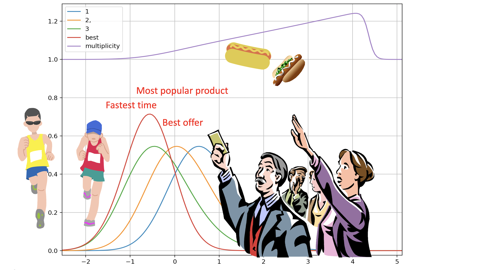

# winning

*A package for dealing with races, correlated or not.*

**Documentation, live demos, and the papers: [winning.microprediction.org](https://winning.microprediction.org)** —
watch the lattice race [beat GHK and Mendell–Elston on wall
time](https://winning.microprediction.org/converge.html) in your
browser, then read how it works.

One race, five covariance grammars, two calls. `race_probabilities`
prices every contestant of a correlated Gaussian (or Gumbel/softmax)
race in one shared-field pass; `abilities_from_race` inverts observed
probabilities back to abilities. Both accept the same covariance
descriptions: factor sugar (`V=`, `D=`), any grammar `structure=`
(independent, factor, blocks, nested, tree), or a dense `cov=` that is
fitted to the grammar on the way in.

- `winning.factor` — the engine: all-share forward pass, inversion,
  exact Jacobians and tie densities, covariance fitting
  (`fit_covariance`), constrained polish.
- `winning.probit` — the same machine in the probit literature's
  max-wins, utilities-and-shares conventions.
- `winning.classic` — the original SIAM-paper lattice ability
  transform (racing vocabulary: dividends, state prices, dead heats);
  see History below.
- `winning.methods` / `winning.bench` — every rival method behind one
  interface, and a seeded accuracy-time benchmark grid:
  `python -m winning.bench.runner`.
- `winning.thurstone` — the density-agnostic research engine for
  arbitrary bases.

[](https://github.com/microprediction/winning/actions)
[](https://opensource.org/licenses/MIT)



## Install

    pip install winning        # core depends only on numpy and scipy

## Quick start

Independent race: shares from abilities, and back.

```python
import numpy as np
from winning import race_probabilities, calibrate_abilities

mu = np.array([-0.5, 0.0, 0.2, 0.3])          # lower is better (min-wins)
p = race_probabilities(mu)                     # array([0.443, 0.232, 0.175, 0.150])
mu_back = calibrate_abilities(p)               # recovers mu (mean zero)
```

Correlated race: a hundred runners moved by two common factors, all
shares in one pass over a shared survival field, then inverted.

```python
rng = np.random.default_rng(0)
N, k = 100, 2
mu = rng.normal(0, 1, N); mu -= mu.mean()
V = rng.normal(0, 0.4, (N, k))                # factor loadings
D = rng.uniform(0.5, 1.5, N)                  # idiosyncratic variances

p = race_probabilities(mu, V=V, D=D)          # all N shares, O(QNL)
mu_hat = calibrate_abilities(p, V=V, D=D)     # inversion
```

Counterfactuals and structure from the same shared field:

```python
from winning import removal_shares, tie_densities

q = removal_shares(mu, V=V, D=D)   # q[i][j] = P(j wins | i removed)
w = tie_densities(mu, V=V, D=D)    # photo-finish weights: the Jacobian's
                                   # graph-Laplacian (circuit) conductances
```

For the probit literature, `winning.probit` speaks max-wins utilities
and shares directly — the paper's own conventions — and is the one
audited reflection onto the internal min-wins race. Both of the paper's
calibrations live here: utilities from observed shares, and the factor
structure itself from a supplied covariance.

```python
from winning.probit import shares, utilities_from_shares, fit_factor_model

utilities = -mu                            # higher is better on this side
p = shares(utilities, V=V, D=D)            # all N choice probabilities
u = utilities_from_shares(p, V=V, D=D)     # the paper's calibration
Sigma = V @ V.T + np.diag(D)
V_hat, D_hat = fit_factor_model(Sigma, k=2)  # certified rank-k contrast fit
p2 = shares(utilities, Sigma=Sigma, k=2)   # same fit applied en route
```

One race, everything a parameter: distribution and correlation chosen
per call, with factor probit just one named point in the family.

```python
from winning.factor import race_probabilities

race_probabilities(mu)                       # the classic independent race
race_probabilities(mu, V=V, D=D)             # factor probit
race_probabilities(mu, base="gumbel")        # Luce / softmax, exactly
race_probabilities(mu, V=V, base="gumbel")   # correlated softmax
race_probabilities(mu, temperature=0.7)      # E[softmin(X/tau)]: soft credit
```

Temperature is exact, not approximate: by the Gumbel-argmin identity the
softmin expectation equals the hard race with each base convolved with
the tau-scaled Gumbel kernel, so the same engine serves it. It is not
identifiable from a single race, so inversion holds it fixed.

Arbitrary *formulas* (skewed, multimodal, anything with a standardized
survival/density callable) run through custom `base=` functions.
Arbitrary *data* — empirical histograms, integer scores, atoms with
real dead-heat mass — belong to `winning.classic`, whose primitive is
the lattice atom vector and whose multiplicity calculus prices genuine
ties exactly. The rule is provenance: formulas to the front door, atoms
to classic; the only error in either workflow is format conversion.
See the module docstrings for the measured costs of crossing over.

## The papers

Six manuscript projects live here; [papers/README.md](papers/README.md)
indexes them all with venue status.

The correlated calibration is documented in *Scalable Share Calibration
for Factor Multinomial Probit Models*
([papers/factor-probit-transform](papers/factor-probit-transform)): all shares of a correlated Gaussian race in one O(QNL)
pass, matrix-free graph-Laplacian derivatives, and inversion at ten
thousand alternatives in under a minute. Every number comes from a
committed, seeded script in
[research/experiments](research/experiments) (index in its README);
`research/experiments/run_all_paper.py` regenerates the lot.

## Demos and other languages

[research/demos](research/demos) holds explanatory scripts (the shared
survival field, the cavity downdate). [js/factor](js/factor) is a
dependency-free JavaScript port at machine-precision parity with the
Python, for browser demos; [r/winning](r/winning) is a pure-R package;
[rust/fastrace](rust/fastrace) holds the optional compiled kernels —
build with `pip install maturin && maturin develop --release`, and
`winning.methods` uses them automatically. Julia is on the roadmap.

## Rating systems (research line)

The renovation-era ratings layer — whole-density beliefs, exact
full-finish-order updates, benchmarked against TrueSkill, OpenSkill,
Glicko-2 and Elo on twelve datasets — lives in [src/](src) pending
integration, with results in [BENCHMARKS.md](BENCHMARKS.md). Headlines:
decisive win on Formula 1 (1,158 grands prix), best calibration on
chess (ECE 0.0047), statistical ties atop WTA/ATP/EPL, and markets
remaining the ceiling wherever they exist. The `ThurstoneRating` API
documented there ships with a future release; it is not importable from
the current package.

## History

Versions 1.x were the SIAM paper's reference implementation. That
original lattice API now lives in `winning.classic` — maintained,
rust-accelerated, and parity-locked against the R and JavaScript ports,
just no longer sprawled across the top level. The old import paths
(`winning.lattice_calibration` and friends) keep working as aliases
that raise a `DeprecationWarning` pointing at the new home.

A 2.0 renovation explored splitting the numerical
core into the separate thurstone package with winning as an
applications layer; the decision went the other way. `winning` owns the
core — heritage and name — the thurstone implementation is vendored
here as `winning.thurstone`, and the thurstone package is a
compatibility shim whose imports resolve to this one. The renovation's
migration notes and unported ideas are preserved in
[planning/](planning) and [attic/](attic).

## Cite

For the correlated engine (the shared field, the covariance grammars,
the substitution Jacobian, removal counterfactuals, and inversion at
scale):

    @article{cotton2026inversion,
    author = {Cotton, Peter},
    title = {Scalable Inversion of Contests with Correlated Performances,
             Including Softmax and Multinomial Probit},
    year = {2026},
    eprint = {2609.01133},
    archivePrefix = {arXiv},
    primaryClass = {stat.ME},
    doi = {10.2139/ssrn.7307363},
    note = {arXiv:2609.01133; also SSRN working paper 7307363},
    URL = {https://arxiv.org/abs/2609.01133}
    }

For the original independent lattice transform (`winning.classic`):

    @article{cotton2021inferring,
    author = {Cotton, Peter},
    title = {Inferring Relative Ability from Winning Probability in Multientrant Contests},
    journal = {SIAM Journal on Financial Mathematics},
    volume = {12},
    number = {1},
    pages = {295-317},
    year = {2021},
    doi = {10.1137/19M1276261},
    URL = {https://doi.org/10.1137/19M1276261}
    }
